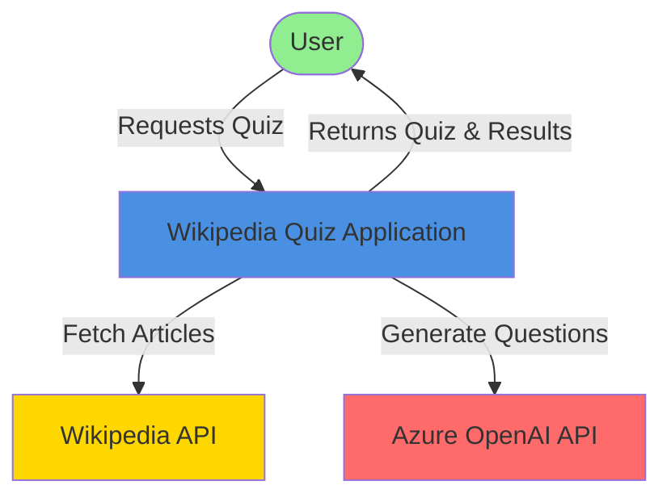
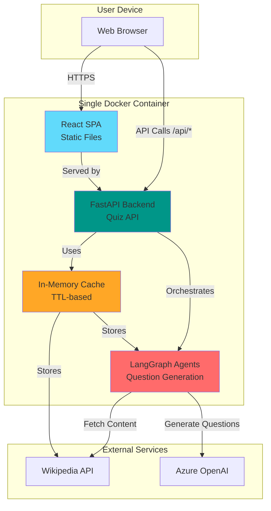
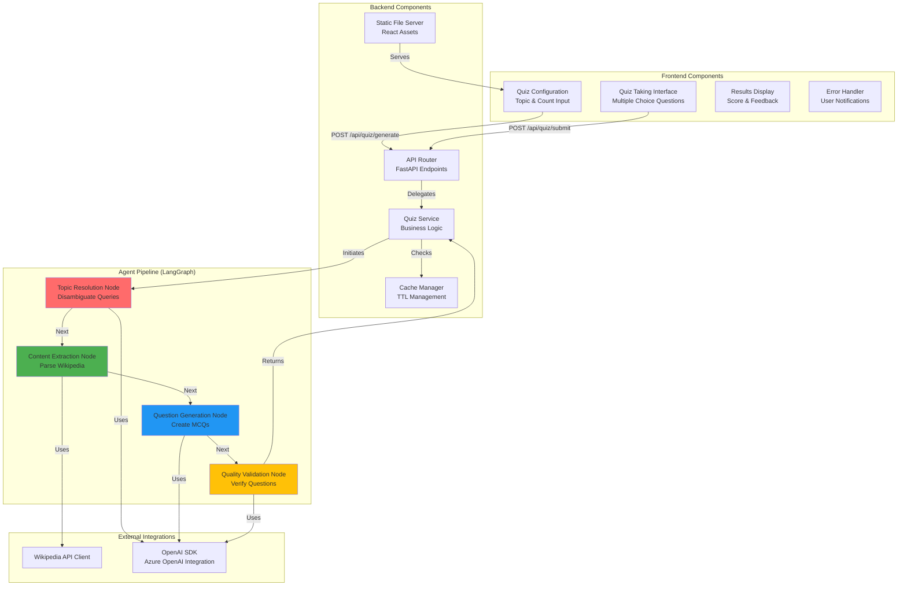
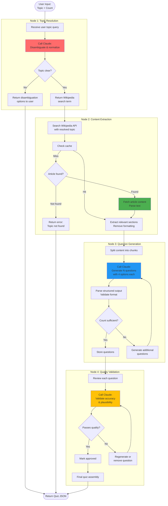

# Wikipedia Quiz Application - Implementation Plan

**Version:** 1.0  
**Date:** December 11, 2025  
**Status:** Active

---

## Executive Summary

This document provides a comprehensive implementation plan for the Wikipedia Quiz Application - an AI-powered quiz generation platform that creates custom multiple-choice quizzes from Wikipedia content.

**Technology Stack:**
- **Frontend:** React + Vite + TypeScript
- **Backend:** FastAPI (Python)
- **AI/Agents:** Azure OpenAI + LangGraph
- **Caching:** In-memory (Python dict with TTL)
- **Deployment:** Single Docker container (FastAPI serving static files)

**Target Timeline:** 4-6 weeks (single developer)

---

## 1. System Architecture Diagrams

### 1.1 L0 - System Context Diagram



**Description:** The Wikipedia Quiz Application is a web-based system where users request quizzes on any topic. The system retrieves content from Wikipedia and uses Claude AI to generate intelligent multiple-choice questions.

---

### 1.2 L1 - Container Diagram



**Description:** Single container deployment where FastAPI serves both the React frontend and API endpoints. The LangGraph agent pipeline orchestrates Wikipedia content retrieval and Azure OpenAI-powered question generation, with in-memory caching for performance.

---

### 1.3 L2 - Component Diagram



**Description:** The frontend provides three main views (quiz creation, taking, results). The backend exposes REST endpoints that leverage a LangGraph pipeline consisting of four sequential nodes for topic resolution, content extraction, question generation, and quality validation.

---

### 1.4 L3 - Agent Pipeline Data Flow



**Description:** Detailed flow through the LangGraph agent pipeline showing decision points, error handling, and the interaction between nodes. Each node has specific responsibilities and Claude is called at strategic points for intelligent processing.

---

## 2. Phased Implementation Plan

### Phase 0: Project Setup & Infrastructure
**Duration:** 3-4 days  
**Objective:** Establish development environment and project structure

#### Task 0.1: Repository & Project Structure
**Description:** Initialize project with monorepo structure for frontend and backend

**Dependencies:** None

**Complexity:** Low

**Steps:**
1. Create project directory structure:
   ```
   /
   ├── frontend/          # React + Vite
   ├── backend/           # FastAPI
   ├── docker/            # Dockerfile & compose
   ├── docs/              # Documentation
   └── .github/workflows/ # CI/CD (optional)
   ```
2. Initialize git repository
3. Create .gitignore for Python and Node

**Acceptance Criteria:**
- [ ] Clean directory structure created
- [ ] Git repository initialized
- [ ] README.md with project overview exists

---

#### Task 0.2: Frontend Scaffolding
**Description:** Set up React + Vite + TypeScript project

**Dependencies:** Task 0.1

**Complexity:** Low

**Steps:**
1. Run `npm create vite@latest frontend -- --template react-ts`
2. Install dependencies: `axios`, `react-router-dom`
3. Configure Vite for API proxy in development
4. Set up basic folder structure:
   ```
   frontend/src/
   ├── components/
   ├── services/
   ├── types/
   ├── pages/
   └── utils/
   ```

**Acceptance Criteria:**
- [ ] Vite dev server runs successfully
- [ ] TypeScript configuration valid
- [ ] Can make requests to localhost:8000/api in dev mode

---

#### Task 0.3: Backend Scaffolding
**Description:** Set up FastAPI project with proper structure

**Dependencies:** Task 0.1

**Complexity:** Low

**Steps:**
1. Create virtual environment: `python -m venv venv`
2. Create requirements.txt with core dependencies:
   - fastapi
   - uvicorn[standard]
   - anthropic
   - langgraph
   - langchain-core
   - wikipedia-api
   - pydantic
3. Create project structure:
   ```
   backend/
   ├── app/
   │   ├── api/         # API routes
   │   ├── agents/      # LangGraph agents
   │   ├── models/      # Pydantic models
   │   ├── services/    # Business logic
   │   └── utils/       # Helpers
   ├── main.py
   └── requirements.txt
   ```
4. Create basic FastAPI app with health check endpoint

**Acceptance Criteria:**
- [ ] FastAPI server runs on localhost:8000
- [ ] /health endpoint returns 200 OK
- [ ] Dependencies install without errors
- [ ] Can serve static files from /static directory

---

#### Task 0.4: Docker Configuration
**Description:** Create Dockerfile and docker-compose for development

**Dependencies:** Task 0.2, Task 0.3

**Complexity:** Medium

**Steps:**
1. Create multi-stage Dockerfile (Node build + Python runtime)
2. Create docker-compose.yml for local development
3. Create .dockerignore
4. Test build process

**Dockerfile Structure:**
```dockerfile
# Stage 1: Build frontend
FROM node:18 AS frontend-build
WORKDIR /app/frontend
COPY frontend/package*.json ./
RUN npm ci
COPY frontend/ ./
RUN npm run build

# Stage 2: Python backend
FROM python:3.11-slim
WORKDIR /app
COPY backend/requirements.txt ./
RUN pip install --no-cache-dir -r requirements.txt
COPY backend/ ./
COPY --from=frontend-build /app/frontend/dist ./static

EXPOSE 8000
CMD ["uvicorn", "main:app", "--host", "0.0.0.0", "--port", "8000"]
```

**Acceptance Criteria:**
- [ ] Docker image builds successfully
- [ ] Container runs and serves application
- [ ] Frontend accessible at http://localhost:8000/
- [ ] API accessible at http://localhost:8000/api/health

---

#### Task 0.5: Environment Configuration
**Description:** Set up environment variables and secrets management

**Dependencies:** Task 0.3

**Complexity:** Low

**Steps:**
1. Create .env.example with required variables:
   ```
   ANTHROPIC_API_KEY=your_key_here
   ENVIRONMENT=development
   LOG_LEVEL=INFO
   CACHE_TTL_WIKIPEDIA=604800
   CACHE_TTL_QUIZ=86400
   ```
2. Create config.py for loading environment variables
3. Add .env to .gitignore
4. Document environment setup in README

**Acceptance Criteria:**
- [ ] Config loads from environment variables
- [ ] Sensible defaults for development
- [ ] .env.example documents all required variables
- [ ] API key validation on startup

---

### Phase 1: Backend Core & API
**Duration:** 5-6 days  
**Objective:** Implement REST API endpoints and data models

#### Task 1.1: Pydantic Models
**Description:** Define data models for requests and responses

**Dependencies:** Task 0.3

**Complexity:** Low

**Steps:**
1. Create models in `app/models/`:
   - `QuizRequest`
   - `QuizResponse`
   - `Question` (with reference URL field)
   - `Option`
   - `SubmitRequest`
   - `SubmitResponse`
2. Add validation rules (min/max values, string lengths)
3. Add `reference_url` field to `Question` model for Wikipedia section links
4. Create example instances for testing

**Acceptance Criteria:**
- [ ] All models defined with proper types
- [ ] Validation rules enforce PRD requirements (3-20 questions, 2-200 char topics)
- [ ] Question model includes optional `reference_url: str` field
- [ ] Models generate correct JSON schema
- [ ] Unit tests for validation pass

---

#### Task 1.2: Cache Manager
**Description:** Implement in-memory cache with TTL support

**Dependencies:** Task 0.3

**Complexity:** Low

**Steps:**
1. Create `app/utils/cache.py` with `SimpleCache` class
2. Implement get/set/delete with TTL tracking
3. Add background cleanup task for expired entries
4. Add cache statistics (hit rate, size)

**Implementation:**
```python
class SimpleCache:
    def __init__(self):
        self._cache: Dict[str, Any] = {}
        self._expiry: Dict[str, float] = {}
    
    def set(self, key: str, value: Any, ttl_seconds: int):
        self._cache[key] = value
        self._expiry[key] = time.time() + ttl_seconds
    
    def get(self, key: str) -> Optional[Any]:
        if key in self._cache:
            if time.time() < self._expiry[key]:
                return self._cache[key]
            else:
                self._cleanup_key(key)
        return None
```

**Acceptance Criteria:**
- [ ] Can store and retrieve values
- [ ] Expired items return None
- [ ] Background cleanup removes expired entries
- [ ] Thread-safe for concurrent access

---

#### Task 1.3: Wikipedia API Client
**Description:** Create wrapper for Wikipedia API interactions

**Dependencies:** Task 0.3, Task 1.2

**Complexity:** Medium

**Steps:**
1. Create `app/services/wikipedia_client.py`
2. Implement search functionality
3. Implement article content retrieval
4. Handle disambiguation pages
5. Integrate with cache manager
6. Add error handling for API failures

**Key Methods:**
- `search_topic(query: str) -> List[SearchResult]`
- `get_article_content(title: str) -> Article`
- `is_disambiguation_page(title: str) -> bool`

**Acceptance Criteria:**
- [ ] Can search Wikipedia and return results
- [ ] Can fetch article content by title
- [ ] Detects and handles disambiguation pages
- [ ] Results cached with 7-day TTL
- [ ] Graceful handling of network errors

---

#### Task 1.4: API Endpoints - Generate Quiz
**Description:** Implement POST /api/quiz/generate endpoint

**Dependencies:** Task 1.1, Task 1.2

**Complexity:** Medium

**Steps:**
1. Create `app/api/quiz.py` router
2. Implement generate endpoint handler
3. Add request validation
4. Add response serialization
5. Integrate cache checking
6. Add error handling for various failure modes

**Acceptance Criteria:**
- [ ] Endpoint accepts valid requests
- [ ] Returns 400 for invalid inputs
- [ ] Returns proper error codes (404, 300, 206, 500)
- [ ] Respects cache for duplicate requests
- [ ] Response matches schema from PRD
- [ ] Request timeout at 30 seconds

---

#### Task 1.5: API Endpoints - Submit Quiz
**Description:** Implement POST /api/quiz/submit endpoint

**Dependencies:** Task 1.1, Task 1.4

**Complexity:** Low

**Steps:**
1. Add submit endpoint to quiz router
2. Validate quiz_id and answers
3. Calculate score
4. Return detailed results
5. Add unit tests

**Acceptance Criteria:**
- [ ] Endpoint validates quiz_id exists
- [ ] Calculates correct/total/percentage
- [ ] Returns which answers were correct/incorrect
- [ ] Handles partial submissions gracefully
- [ ] Response matches schema from PRD

---

### Phase 2: LangGraph Agent Pipeline
**Duration:** 7-9 days  
**Objective:** Implement 4-node agent pipeline for quiz generation

#### Task 2.1: LangGraph Setup & State Definition
**Description:** Set up LangGraph structure and define agent state

**Dependencies:** Task 0.3

**Complexity:** Medium

**Steps:**
1. Create `app/agents/graph.py`
2. Define `QuizGenerationState` class with TypedDict
3. Set up LangGraph StateGraph
4. Configure Claude client
5. Add logging and monitoring

**State Structure:**
```python
class QuizGenerationState(TypedDict):
    topic: str
    num_questions: int
    resolved_topic: Optional[str]
    wikipedia_content: Optional[str]
    raw_questions: Optional[List[Dict]]
    validated_questions: Optional[List[Question]]
    errors: List[str]
    metadata: Dict[str, Any]
```

**Acceptance Criteria:**
- [ ] State graph initializes correctly
- [ ] State can be passed between nodes
- [ ] Claude client configured with API key
- [ ] Error state tracked properly

---

#### Task 2.2: Node 1 - Topic Resolution
**Description:** Implement topic disambiguation and normalization

**Dependencies:** Task 2.1

**Complexity:** Medium

**Steps:**
1. Create `app/agents/nodes/topic_resolver.py`
2. Design Claude prompt for topic disambiguation
3. Implement node function
4. Handle ambiguous topics
5. Add retry logic for API failures

**Prompt Strategy:**
```
Given user topic "{topic}", determine:
1. Is this topic clear and unambiguous?
2. What is the best Wikipedia article title to search?
3. If ambiguous, what are the top 3 most likely meanings?

Return structured JSON.
```

**Acceptance Criteria:**
- [ ] Clear topics return Wikipedia search term
- [ ] Ambiguous topics return options list
- [ ] Handles typos and variations
- [ ] Completes in <2 seconds
- [ ] Updates state correctly

---

#### Task 2.3: Node 2 - Content Extraction
**Description:** Fetch and parse Wikipedia content

**Dependencies:** Task 2.2, Task 1.3

**Complexity:** Medium

**Steps:**
1. Create `app/agents/nodes/content_extractor.py`
2. Use Wikipedia client to fetch article
3. Parse and clean content (remove citations, formatting)
4. Extract relevant sections
5. Handle content length (truncate if needed)
6. Update state with extracted content

**Acceptance Criteria:**
- [ ] Fetches article based on resolved topic
- [ ] Removes Wikipedia markup and citations
- [ ] Extracts substantive content suitable for questions
- [ ] Handles short articles gracefully
- [ ] Completes in <2 seconds
- [ ] Integrates with cache

---

#### Task 2.4: Node 3 - Question Generation
**Description:** Generate multiple-choice questions using Claude with reference URLs

**Dependencies:** Task 2.3

**Complexity:** High

**Steps:**
1. Create `app/agents/nodes/question_generator.py`
2. Design Claude prompt for question generation
3. Request structured JSON output including reference information
4. Generate Wikipedia section URLs for each question's answer
5. Implement parallel generation for efficiency
6. Handle partial failures
7. Ensure correct number of questions

**Prompt Strategy:**
```
Based on this Wikipedia content about {topic}, generate {num_questions} 
multiple-choice questions.

For each question:
- Ask about factual information from the text
- Provide exactly 4 answer options (A, B, C, D)
- Mark the correct answer
- Identify the specific Wikipedia section or heading where the answer can be found
- Make incorrect answers plausible but clearly wrong
- Ensure diversity in question types

Return as JSON array with reference information for verification.
```

**Reference URL Format:**
- Base Wikipedia URL + article title + section anchor
- Example: `https://en.wikipedia.org/wiki/Novo_Nordisk#Products_and_research`

**Acceptance Criteria:**
- [ ] Generates requested number of questions
- [ ] Each question has 4 options
- [ ] Questions are factually grounded in content
- [ ] Each question includes a reference URL to relevant Wikipedia section
- [ ] Reference URLs are properly formatted and valid
- [ ] Distractors are plausible
- [ ] Completes in <4 seconds
- [ ] Returns structured data matching schema

---

#### Task 2.5: Node 4 - Quality Validation
**Description:** Validate and refine generated questions

**Dependencies:** Task 2.4

**Complexity:** Medium

**Steps:**
1. Create `app/agents/nodes/quality_validator.py`
2. Design validation prompt for Claude
3. Check each question for:
   - Factual accuracy
   - Clear wording
   - Plausible distractors
   - No ambiguity
4. Regenerate failed questions or remove if time limited
5. Final assembly into quiz format

**Acceptance Criteria:**
- [ ] Validates factual accuracy against source
- [ ] Ensures question clarity
- [ ] Verifies distractor quality
- [ ] Completes in <2 seconds
- [ ] Returns final validated question set
- [ ] Logs quality metrics

---

#### Task 2.6: Graph Compilation & Integration
**Description:** Wire up all nodes and integrate with API

**Dependencies:** Task 2.2, Task 2.3, Task 2.4, Task 2.5

**Complexity:** Medium

**Steps:**
1. Define graph edges and conditional routing
2. Add error handling and timeout management
3. Integrate compiled graph with quiz service
4. Add comprehensive logging
5. Test end-to-end flow

**Graph Structure:**
```python
graph = StateGraph(QuizGenerationState)
graph.add_node("topic_resolution", resolve_topic)
graph.add_node("content_extraction", extract_content)
graph.add_node("question_generation", generate_questions)
graph.add_node("quality_validation", validate_quality)

graph.add_edge("topic_resolution", "content_extraction")
graph.add_edge("content_extraction", "question_generation")
graph.add_edge("question_generation", "quality_validation")
graph.set_entry_point("topic_resolution")
```

**Acceptance Criteria:**
- [ ] All nodes connected correctly
- [ ] State flows through pipeline
- [ ] Errors handled at each stage
- [ ] Total pipeline completes in <10 seconds
- [ ] Integration tests pass
- [ ] Can generate quiz from API endpoint

---

### Phase 3: Frontend Development
**Duration:** 6-7 days  
**Objective:** Build React user interface

#### Task 3.1: API Service Layer
**Description:** Create TypeScript API client for backend

**Dependencies:** Task 0.2

**Complexity:** Low

**Steps:**
1. Create `frontend/src/services/api.ts`
2. Define TypeScript interfaces matching backend models
3. Implement API methods:
   - `generateQuiz(topic, numQuestions)`
   - `submitQuiz(quizId, answers)`
4. Add error handling and response parsing
5. Configure axios with base URL

**Acceptance Criteria:**
- [ ] API methods properly typed
- [ ] Error responses handled gracefully
- [ ] Request/response interceptors configured
- [ ] Loading states supported

---

#### Task 3.2: Quiz Configuration Page
**Description:** Build topic input and question count selector

**Dependencies:** Task 3.1

**Complexity:** Medium

**Steps:**
1. Create `frontend/src/pages/QuizConfig.tsx`
2. Build form with:
   - Topic text input (validation: 2-200 chars)
   - Question count selector (3-20)
   - Generate button
3. Add form validation
4. Show loading state during generation
5. Handle errors (topic not found, disambiguation)
6. Add basic styling

**Acceptance Criteria:**
- [ ] Form validates inputs before submission
- [ ] Loading spinner shown during generation
- [ ] Errors displayed clearly to user
- [ ] Disambiguation options presented when needed
- [ ] Responsive on mobile and desktop
- [ ] Meets accessibility standards

---

#### Task 3.3: Quiz Taking Interface
**Description:** Display questions and capture user answers

**Dependencies:** Task 3.1

**Complexity:** Medium

**Steps:**
1. Create `frontend/src/pages/QuizTaking.tsx`
2. Create `frontend/src/components/Question.tsx`
3. Display questions with radio button options
4. Track selected answers in state
5. Show progress indicator
6. Implement submit functionality
7. Allow answer changes before submission

**Acceptance Criteria:**
- [ ] All questions displayed clearly
- [ ] User can select one answer per question
- [ ] Selected answers visually distinct
- [ ] Progress shown (e.g., "Question 3 of 10")
- [ ] Submit button enabled when all answered
- [ ] Responsive design works on mobile

---

#### Task 3.4: Results Display Page
**Description:** Show quiz results with detailed feedback and reference links

**Dependencies:** Task 3.1

**Complexity:** Medium

**Steps:**
1. Create `frontend/src/pages/Results.tsx`
2. Display overall score (fraction and percentage)
3. Show each question with:
   - User's answer
   - Correct answer
   - Correct/incorrect indicator
   - Reference link to Wikipedia section (inline with correct answer)
4. Add navigation options (retake, new quiz)
5. Add visual styling (colors for correct/incorrect)
6. Implement clickable "Verify" links that open Wikipedia in new tab

**Acceptance Criteria:**
- [ ] Score displayed prominently
- [ ] Each correct answer includes a "Verify" reference link
- [ ] Reference links point to specific Wikipedia article sections
- [ ] Links open in new browser tab (target="_blank" with rel="noopener noreferrer")
- [ ] Reference links are visually distinct (colored, underlined)
- [ ] All questions shown with feedback
- [ ] Correct answers highlighted
- [ ] User's incorrect answers shown
- [ ] Clear navigation to start new quiz
- [ ] Celebratory messaging for good scores

---

#### Task 3.5: Routing & Navigation
**Description:** Set up React Router and page navigation

**Dependencies:** Task 3.2, Task 3.3, Task 3.4

**Complexity:** Low

**Steps:**
1. Install and configure react-router-dom
2. Define routes:
   - `/` - Quiz configuration
   - `/quiz/:quizId` - Quiz taking
   - `/results/:quizId` - Results display
3. Implement navigation between pages
4. Add 404 page
5. Handle browser back button

**Acceptance Criteria:**
- [ ] Routes navigate correctly
- [ ] Quiz state preserved during navigation
- [ ] Back button works as expected
- [ ] Deep linking works for quiz IDs
- [ ] Clean URLs without hash

---

#### Task 3.6: UI Polish & Responsive Design
**Description:** Enhance visual design and mobile experience

**Dependencies:** Task 3.2, Task 3.3, Task 3.4

**Complexity:** Medium

**Steps:**
1. Apply consistent styling (CSS/Tailwind)
2. Test on mobile devices (320px min width)
3. Add animations and transitions
4. Improve loading states
5. Add error boundaries
6. Accessibility audit and fixes

**Acceptance Criteria:**
- [ ] Consistent design across all pages
- [ ] Works on mobile (320px+), tablet, desktop
- [ ] Loading states smooth and informative
- [ ] Error states helpful and non-blocking
- [ ] Passes WCAG 2.1 AA accessibility
- [ ] Keyboard navigation works

---

### Phase 4: Integration & Testing
**Duration:** 4-5 days  
**Objective:** Connect all components and ensure quality

#### Task 4.1: End-to-End Integration
**Description:** Connect frontend to backend and test full flow

**Dependencies:** Phase 2, Phase 3

**Complexity:** Medium

**Steps:**
1. Configure CORS in FastAPI
2. Build frontend production bundle
3. Configure FastAPI to serve static files
4. Test complete user journey
5. Fix integration issues
6. Verify all error paths work

**Acceptance Criteria:**
- [ ] Frontend can call backend APIs
- [ ] Static files served correctly
- [ ] CORS configured properly
- [ ] Happy path works end-to-end
- [ ] Error scenarios handled gracefully
- [ ] No console errors

---

#### Task 4.2: Backend Unit Tests
**Description:** Write unit tests for backend components

**Dependencies:** Phase 1, Phase 2

**Complexity:** Medium

**Steps:**
1. Set up pytest and test structure
2. Write tests for:
   - Cache manager
   - Wikipedia client
   - Pydantic models
   - API endpoints (with mocks)
3. Aim for >80% coverage on critical paths
4. Mock external APIs (Claude, Wikipedia)

**Acceptance Criteria:**
- [ ] Test suite runs successfully
- [ ] Cache tests verify TTL behavior
- [ ] API endpoint tests cover success and error cases
- [ ] External APIs properly mocked
- [ ] Coverage >80% on services and utils

---

#### Task 4.3: Frontend Unit Tests
**Description:** Write tests for React components

**Dependencies:** Phase 3

**Complexity:** Low

**Steps:**
1. Set up Vitest and React Testing Library
2. Write tests for:
   - Form validation
   - Question component
   - API service layer
3. Test user interactions
4. Snapshot tests for key components

**Acceptance Criteria:**
- [ ] Test suite runs successfully
- [ ] Form validation tested
- [ ] User interaction tests pass
- [ ] API mocking works correctly
- [ ] Coverage >70% on components

---

#### Task 4.4: Performance Testing
**Description:** Verify performance requirements are met

**Dependencies:** Task 4.1

**Complexity:** Medium

**Steps:**
1. Test quiz generation time (<10 seconds)
2. Test frontend load time (<2 seconds)
3. Test concurrent user handling
4. Profile LLM token usage and costs
5. Identify and fix bottlenecks

**Acceptance Criteria:**
- [ ] 90% of quizzes generate in <10 seconds
- [ ] Frontend loads in <2 seconds
- [ ] Handles 10 concurrent requests
- [ ] Cost per quiz <$0.02
- [ ] No memory leaks in cache

---

#### Task 4.5: Error Handling & Edge Cases
**Description:** Test and improve error scenarios

**Dependencies:** Task 4.1

**Complexity:** Medium

**Steps:**
1. Test with invalid topics
2. Test with ambiguous topics
3. Test with minimal content articles
4. Test API rate limiting
5. Test network failures
6. Improve error messages and recovery

**Edge Cases to Test:**
- Very short topics ("AI")
- Very long topics (200 chars)
- Non-existent topics
- Topics with special characters
- Disambiguation pages
- Stub articles (minimal content)
- API timeouts
- Invalid API keys

**Acceptance Criteria:**
- [ ] All edge cases handled gracefully
- [ ] Error messages are user-friendly
- [ ] System doesn't crash on bad input
- [ ] Logging captures diagnostic info
- [ ] Recovery paths work correctly

---

### Phase 5: Deployment & Documentation
**Duration:** 3-4 days  
**Objective:** Deploy application and create documentation

#### Task 5.1: Production Dockerfile & Build
**Description:** Finalize Docker configuration for production

**Dependencies:** Task 4.1

**Complexity:** Low

**Steps:**
1. Optimize Dockerfile (multi-stage, layer caching)
2. Add health check endpoint
3. Configure proper logging
4. Set production environment defaults
5. Test build locally

**Acceptance Criteria:**
- [ ] Docker image builds successfully
- [ ] Image size optimized (<500MB)
- [ ] Health check endpoint works
- [ ] Logs output to stdout
- [ ] Environment variables properly handled

---

#### Task 5.2: Deployment to Railway/Render
**Description:** Deploy to cloud hosting platform

**Dependencies:** Task 5.1

**Complexity:** Medium

**Steps:**
1. Create account on Railway or Render
2. Connect GitHub repository
3. Configure environment variables
4. Set up automatic deployments
5. Configure custom domain (optional)
6. Test deployed application

**Platform Recommendation:** Railway.app
- Excellent free tier
- Simple GitHub integration
- Environment variable management
- Automatic HTTPS

**Acceptance Criteria:**
- [ ] Application deployed and accessible
- [ ] HTTPS working
- [ ] Environment variables secured
- [ ] Automatic deployments configured
- [ ] Health check passing

---

#### Task 5.3: User Documentation
**Description:** Create user-facing documentation

**Dependencies:** Task 5.2

**Complexity:** Low

**Steps:**
1. Write README.md with:
   - Project description
   - Demo link
   - Features overview
   - Usage instructions
   - Screenshots
2. Create CONTRIBUTING.md
3. Add LICENSE file
4. Write API documentation (OpenAPI/Swagger)

**Acceptance Criteria:**
- [ ] README clear and comprehensive
- [ ] Screenshots show key features
- [ ] API docs auto-generated from FastAPI
- [ ] License included
- [ ] Links to live demo work

---

#### Task 5.4: Developer Documentation
**Description:** Document setup and architecture for developers

**Dependencies:** All phases

**Complexity:** Medium

**Steps:**
1. Write setup guide (local development)
2. Document architecture decisions (link ADRs)
3. Create deployment guide
4. Document environment variables
5. Add troubleshooting section
6. Include performance tuning tips

**Documentation Structure:**
```
docs/
├── SETUP.md           # Local development setup
├── ARCHITECTURE.md    # System architecture overview
├── DEPLOYMENT.md      # Deployment guide
├── API.md             # API documentation
├── TROUBLESHOOTING.md # Common issues
└── PERFORMANCE.md     # Optimization tips
```

**Acceptance Criteria:**
- [ ] Developer can set up project from docs alone
- [ ] Architecture clearly explained
- [ ] Deployment repeatable from guide
- [ ] Troubleshooting covers common issues
- [ ] Links to ADRs included

---

#### Task 5.5: Monitoring & Observability
**Description:** Add basic monitoring and logging

**Dependencies:** Task 5.2

**Complexity:** Low

**Steps:**
1. Configure structured logging
2. Add request ID tracking
3. Log key metrics:
   - Quiz generation time
   - API errors
   - Cache hit rate
   - LLM token usage
4. Set up basic alerting (optional)
5. Create simple dashboard (optional)

**Acceptance Criteria:**
- [ ] Logs are structured (JSON)
- [ ] Request IDs track user journeys
- [ ] Key metrics logged
- [ ] Errors captured with stack traces
- [ ] Logs accessible in deployment platform

---

## 3. Task Summary Matrix

| Phase | Task | Complexity | Duration | Dependencies |
|-------|------|------------|----------|--------------|
| **0: Setup** | 0.1 Repository Structure | Low | 0.5 days | None |
| | 0.2 Frontend Scaffolding | Low | 0.5 days | 0.1 |
| | 0.3 Backend Scaffolding | Low | 1 day | 0.1 |
| | 0.4 Docker Configuration | Medium | 1 day | 0.2, 0.3 |
| | 0.5 Environment Config | Low | 0.5 days | 0.3 |
| **1: Backend** | 1.1 Pydantic Models | Low | 0.5 days | 0.3 |
| | 1.2 Cache Manager | Low | 1 day | 0.3 |
| | 1.3 Wikipedia Client | Medium | 1.5 days | 0.3, 1.2 |
| | 1.4 Generate Endpoint | Medium | 1.5 days | 1.1, 1.2 |
| | 1.5 Submit Endpoint | Low | 1 day | 1.1, 1.4 |
| **2: Agents** | 2.1 LangGraph Setup | Medium | 1.5 days | 0.3 |
| | 2.2 Topic Resolution | Medium | 1.5 days | 2.1 |
| | 2.3 Content Extraction | Medium | 1.5 days | 2.2, 1.3 |
| | 2.4 Question Generation | High | 2.5 days | 2.3 |
| | 2.5 Quality Validation | Medium | 1.5 days | 2.4 |
| | 2.6 Graph Integration | Medium | 1.5 days | 2.2-2.5 |
| **3: Frontend** | 3.1 API Service Layer | Low | 1 day | 0.2 |
| | 3.2 Quiz Config Page | Medium | 1.5 days | 3.1 |
| | 3.3 Quiz Taking UI | Medium | 1.5 days | 3.1 |
| | 3.4 Results Page | Medium | 1.5 days | 3.1 |
| | 3.5 Routing | Low | 0.5 days | 3.2-3.4 |
| | 3.6 UI Polish | Medium | 1.5 days | 3.2-3.4 |
| **4: Testing** | 4.1 E2E Integration | Medium | 1.5 days | Phase 2, 3 |
| | 4.2 Backend Tests | Medium | 1.5 days | Phase 1, 2 |
| | 4.3 Frontend Tests | Low | 1 day | Phase 3 |
| | 4.4 Performance Testing | Medium | 1 day | 4.1 |
| | 4.5 Error Handling | Medium | 1 day | 4.1 |
| **5: Deploy** | 5.1 Production Build | Low | 0.5 days | 4.1 |
| | 5.2 Cloud Deployment | Medium | 1 day | 5.1 |
| | 5.3 User Docs | Low | 1 day | 5.2 |
| | 5.4 Developer Docs | Medium | 1.5 days | All |
| | 5.5 Monitoring | Low | 0.5 days | 5.2 |

**Total Estimated Duration:** 25-30 working days (5-6 weeks for single developer)

---

## 4. Risk Assessment & Mitigation

### High-Risk Items

#### Risk 1: LLM API Performance
**Description:** Claude API may not consistently meet <6 second requirement

**Mitigation:**
- Optimize prompts for conciseness
- Implement parallel question generation
- Use Claude's streaming capabilities
- Cache results aggressively
- Consider fallback to fewer questions if approaching timeout

#### Risk 2: LLM API Costs
**Description:** Costs may exceed budget during development/testing

**Mitigation:**
- Set hard budget limits in Anthropic dashboard
- Mock LLM responses during development
- Use shorter content chunks for testing
- Monitor token usage in logs
- Implement request throttling

#### Risk 3: Wikipedia Content Quality
**Description:** Some topics may have insufficient content for question generation

**Mitigation:**
- Detect short articles early in pipeline
- Reduce question count automatically
- Provide clear user feedback
- Cache negative results to avoid repeated attempts
- Guide users to better topics

### Medium-Risk Items

#### Risk 4: Question Quality Variability
**Description:** LLM may generate low-quality questions inconsistently

**Mitigation:**
- Implement quality validation node
- Use few-shot examples in prompts
- Log quality metrics for monitoring
- Allow user feedback mechanism
- Iterate on prompts based on results

#### Risk 5: Cache Memory Growth
**Description:** In-memory cache may consume excessive memory

**Mitigation:**
- Implement max cache size limit
- Background cleanup task for expired entries
- Monitor memory usage
- Reduce TTL if needed
- Add cache eviction policy (LRU)

---

## 5. Success Criteria

### Technical Metrics
- [ ] Quiz generation success rate >90%
- [ ] Average generation time <10 seconds
- [ ] Frontend load time <2 seconds
- [ ] Backend test coverage >80%
- [ ] Frontend test coverage >70%
- [ ] Zero critical security vulnerabilities
- [ ] Cost per quiz <$0.02

### Functional Completeness
- [ ] User can generate quiz on any valid topic
- [ ] User can take quiz and receive immediate feedback
- [ ] System handles errors gracefully
- [ ] All PRD acceptance criteria met
- [ ] Mobile responsive design
- [ ] WCAG 2.1 AA accessibility compliance

### Deployment
- [ ] Application deployed to cloud platform
- [ ] Accessible via HTTPS
- [ ] Automatic deployments configured
- [ ] Environment variables secured
- [ ] Health checks operational

### Documentation
- [ ] User documentation complete
- [ ] Developer setup guide complete
- [ ] API documentation available
- [ ] Architecture diagrams current
- [ ] ADRs linked and referenced

---

## 6. Post-Launch Roadmap (Future Enhancements)

### Phase 6: Enhancements (Optional)
- User accounts and quiz history
- Difficulty level selection
- Topic suggestions/autocomplete
- Share quiz results
- Leaderboards
- Timed quizzes
- True/False and open-ended questions
- Multi-language support
- Offline mode (PWA)
- Analytics dashboard

### Phase 7: Scale & Optimization (If Needed)
- Migrate to Redis for distributed caching
- Separate frontend to CDN (Vercel/Netlify)
- Add rate limiting and API authentication
- Implement proper database for quiz persistence
- Horizontal scaling with load balancer
- Advanced monitoring (Datadog, New Relic)
- A/B testing framework

---

## 7. References

### Technical Documentation
- [PRD](prd.md) - Product Requirements Document
- [ADR 001](adr/001-frontend-framework.md) - React + Vite Frontend
- [ADR 002](adr/002-llm-and-agent-framework.md) - Claude + LangGraph
- [ADR 003](adr/003-caching-strategy.md) - In-Memory Caching
- [ADR 004](adr/004-deployment-architecture.md) - Single Container Deployment

### External Resources
- [FastAPI Documentation](https://fastapi.tiangolo.com/)
- [React Documentation](https://react.dev/)
- [LangGraph Documentation](https://langchain-ai.github.io/langgraph/)
- [Anthropic Claude API](https://docs.anthropic.com/)
- [Wikipedia API](https://www.mediawiki.org/wiki/API:Main_page)
- [Railway Documentation](https://docs.railway.app/)

---

## 8. Notes & Assumptions

### Assumptions
1. Single developer working full-time
2. Anthropic API key available
3. Basic familiarity with React and Python
4. Development environment: VS Code, Docker, Git
5. Target: MVP for demo/learning purposes, not production scale

### Key Decisions
- **Single Container:** Prioritizes simplicity over scalability
- **In-Memory Cache:** Acceptable for demo; restarts clear cache
- **No Database:** Stateless design reduces operational complexity
- **No Authentication:** Open access for demo purposes
- **Claude 3.5 Sonnet:** Best balance of quality, speed, and cost

### Implementation Philosophy
- **Iterative Development:** Build in phases, test frequently
- **Fail Fast:** Validate critical assumptions early (LLM performance, costs)
- **Document Decisions:** Capture rationale in ADRs and comments
- **Test Driven:** Write tests alongside implementation
- **User-Centric:** Prioritize UX over technical perfection

---

**End of Implementation Plan**
